# Project 1: Active Directory Domain

## Goal
Build a Windows Active Directory domain for a fictional company (`corp.lan`) in a virtual lab, to practise core sysadmin and helpdesk skills.

**Status:** Part A (domain controller build and verification) complete. Part B (OUs, users, groups, Group Policy, file share, PowerShell scripting) in progress.

## Architecture
- **Host:** Windows PC, AMD Ryzen 7 3700X, 16 GB RAM, VirtualBox 7.2
- **Network:** `LabNet`, an isolated NAT network (192.168.10.0/24) with internet access and no inbound exposure
- **DC01:** Windows Server 2022 Standard Evaluation, 4 GB RAM, 2 vCPU, 50 GB disk, static IP 192.168.10.10
- **Domain:** `corp.lan` (NetBIOS name `CORP`), functional level Windows Server 2016

```
[Host PC]
   └── VirtualBox
         └── LabNet (192.168.10.0/24)
               └── DC01 (192.168.10.10): AD DS + DNS
```

## Build Steps (Part A)

### 1. Host and network
Checked host specs, then created the isolated `LabNet` network with DHCP disabled so the server can use a fixed address.

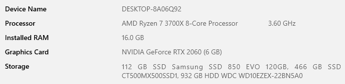
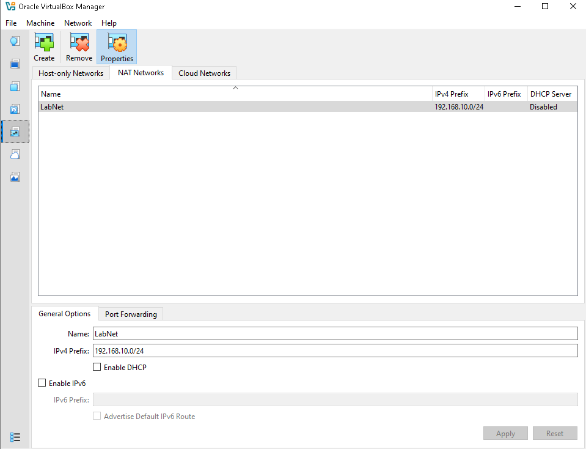

### 2. Create the DC01 virtual machine
Created the VM with 4 GB RAM, 2 CPUs and a 50 GB disk, attached to `LabNet`.

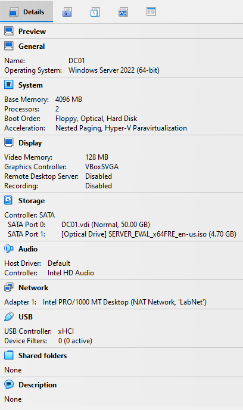

### 3. Install Windows Server and rename the server
Installed Windows Server 2022 Standard (Desktop Experience), installed VirtualBox Guest Additions, took a snapshot, and renamed the server to `DC01`.

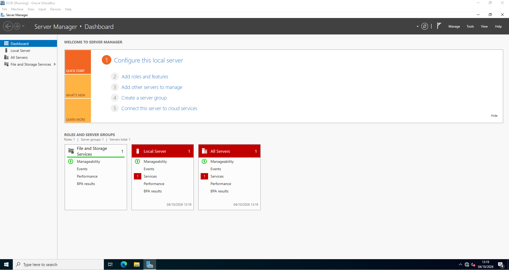
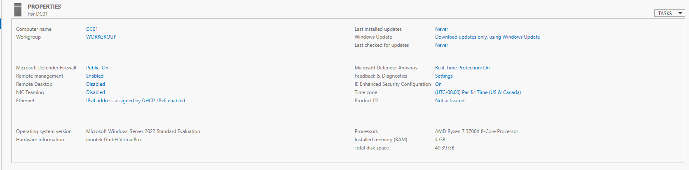

### 4. Static IP and connectivity test
Set a static IP (192.168.10.10/24, gateway 192.168.10.1) with a temporary DNS server, then confirmed internet and DNS worked with `ping`.

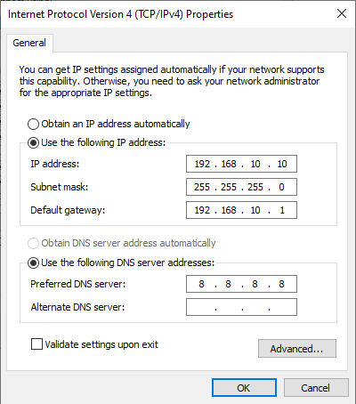
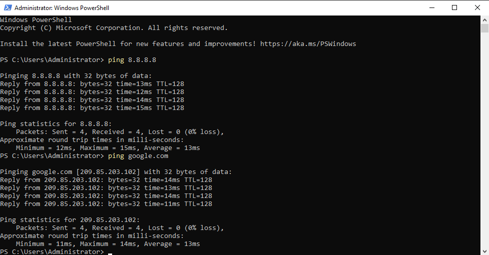

### 5. Install AD DS and promote to domain controller
Installed the Active Directory Domain Services role and promoted DC01 to the first domain controller of a new forest, `corp.lan`.

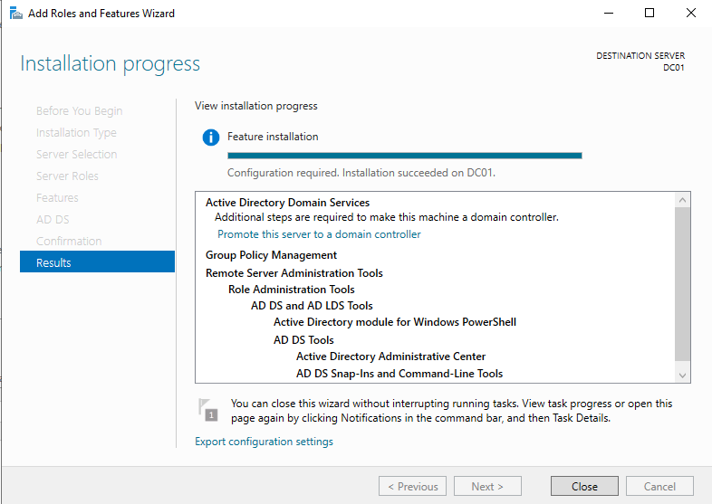
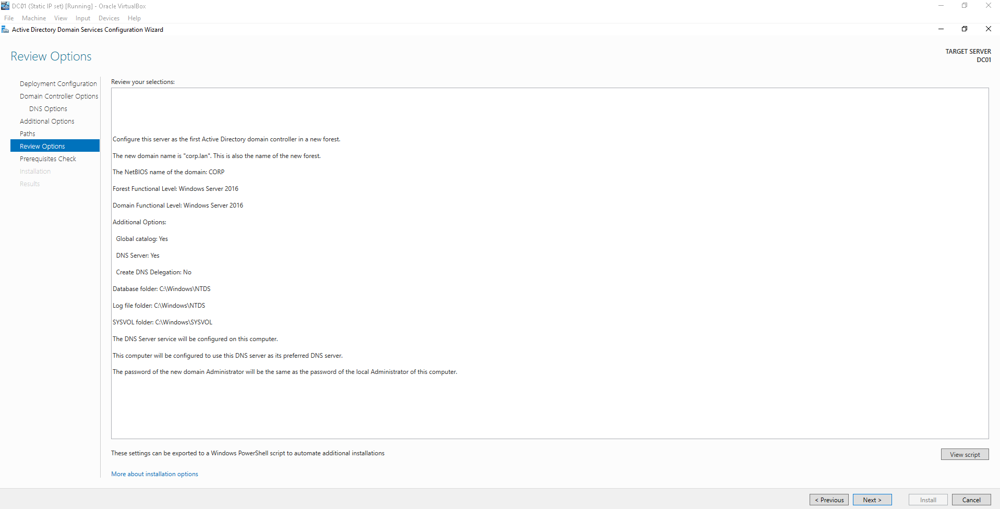

### 6. Verify the domain
Checked the domain with `Get-ADDomain` and `dcdiag`, and confirmed DC01 now uses itself as its DNS server while still resolving internet names.

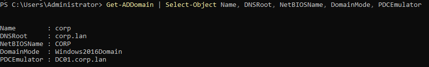
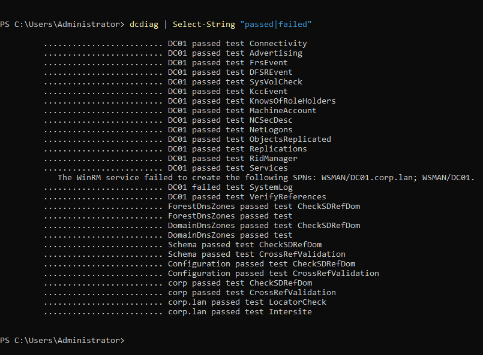
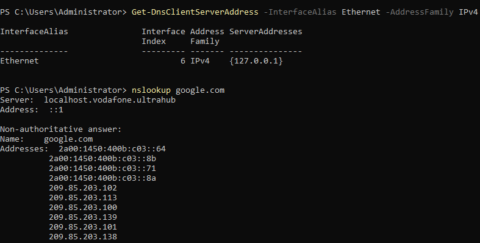

## Issues & Fixes

### dcdiag failed test: SystemLog (WinRM SPN registration)
- **Symptom:** `dcdiag` reported `failed test SystemLog`. The log showed that the WinRM service failed to create the SPNs `WSMAN/DC01.corp.lan` and `WSMAN/DC01`. Every other test passed.
- **Cause:** WinRM tried to register its SPNs during promotion, before Active Directory had finished starting.
- **Diagnosis:** `setspn -L DC01` showed no WSMAN entries. Restarting the WinRM service did not register them.
- **Fix:** Registered them manually:
```
  setspn -S WSMAN/DC01 DC01
  setspn -S WSMAN/DC01.corp.lan DC01
```
- **Verification:** `setspn -L DC01 | Select-String WSMAN` now lists both entries.


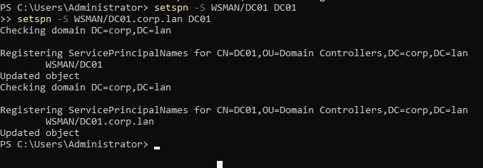
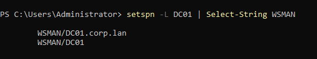

## What I'd Do Differently
(to be completed after Part B)
